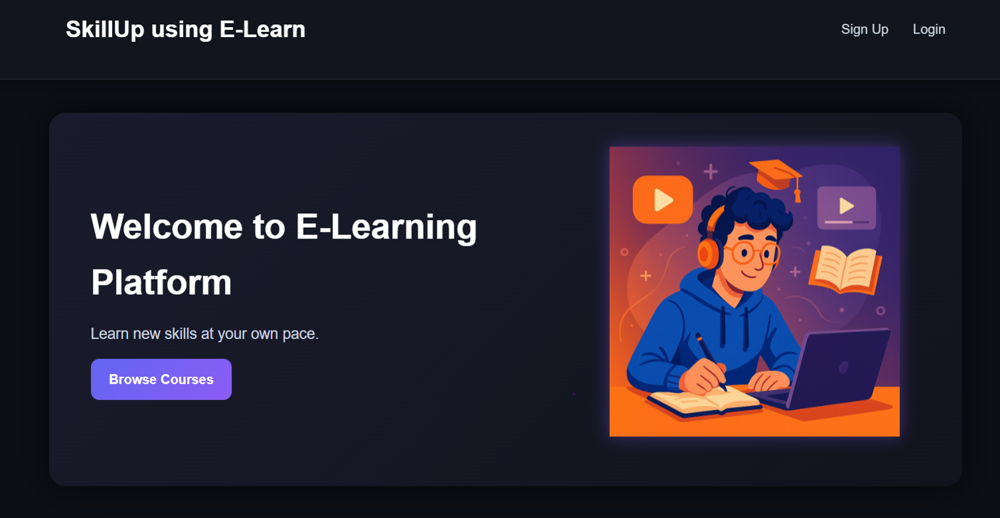

# 🎓 E-Learning Management System

A **Full-Stack E-Learning Management System** built using **Java Spring Boot, Hibernate, JPA and MySQL** with a **HTML5 & CSS3 frontend**.

The platform enables **students, instructors, and administrators** to manage and access online courses efficiently through a secure and structured system.

This project demonstrates **modern Java backend architecture, database integration, and web application development**, making it a strong portfolio project for backend and full-stack development.

---
# 🚀 Project Overview

The **E-Learning Management System (LMS)** is designed to provide a centralized platform where:

- 👨‍🎓 Students can enroll and access courses  
- 👩‍🏫 Instructors can create and manage course content  
- 🛠 Administrators can manage users and platform activities
- 🗃 Supports Database-driven Operations through RESTful APIs  

The application follows a **layered architecture using Spring Boot**, ensuring scalability, maintainability, and separation of concerns.

---
## 📸 Application Preview

<p align="center">
  
</p>

# 🏗 System Architecture

```
Frontend (HTML5, CSS3)
        │
        ▼
Controller Layer (Spring Boot Controllers)
        │
        ▼
Service Layer (Business Logic)
        │
        ▼
Repository Layer (Spring Data JPA / Hibernate)
        │
        ▼
Database (MySQL)
```

---

# 🛠 Tech Stack

## Backend
- ☕ Java
- 🌱 Spring Boot
- 🗄 Hibernate
- 📦 Spring Data JPA
- 🔧 Maven

## Frontend
- 🌐 HTML5
- 🎨 CSS3

## Database
- 🗃 MySQL

## Development Tools
- Eclipse IDE & Maven
- Visual Studio Code
- MySQL 
- Git & GitHub

---

# ✨ Key Features

## 👨‍🎓 Student
- Register and login
- Browse available courses
- Enroll in courses
- Access course content

## 👩‍🏫 Instructor
- Create courses
- Manage course materials
- View enrolled students

## 🛠 Admin
- Manage users
- Manage courses
- Monitor platform activity

---

# 📂 Project Structure

```
Java-Project
│
├── src
│   ├── main
│   │   ├── java
│   │   │   ├── controller
│   │   │   ├── service
│   │   │   ├── repository
│   │   │   ├── model
│   │   │   └── configuration
│   │   │
│   │   └── resources
│   │       ├── templates
│   │       ├── static
│   │       └── application.properties
│
├── pom.xml
└── README.md
```

---

# ⚙️ Installation & Setup

### 1️⃣ Clone the Repository

```bash
git clone https://github.com/SreevatsaK/Java-Project.git
```

---

### 2️⃣ Navigate to the Project

```bash
cd Java-Project
```

---

### 3️⃣ Configure Database

Update the **application.properties** file:

```
spring.datasource.url=jdbc:mysql://localhost:3306/elearning_db
spring.datasource.username=root
spring.datasource.password=yourpassword
```

---

### 4️⃣ Build the Project

```bash
mvn clean install
```

---

### 5️⃣ Run the Application

```bash
mvn spring-boot:run
```

---

### 6️⃣ Access the Application

```
http://localhost:8080
```

---

# 📸 Future Improvements

- 📊 Student progress tracking  
- 🧾 Online quizzes & assessments  
- 📹 Video lecture integration  
- 🔐 Spring Security authentication  
- 📧 Email notifications  

---

# 🎯 Learning Outcomes

This project helped in understanding:

- Spring Boot backend development  
- RESTful API design  
- Hibernate ORM mapping  
- Database integration using JPA  
- MVC architecture in web applications  
- Full-stack application development  

---

# 🤝 Contributing

Contributions are welcome!

1. Fork the repository  
2. Create a new branch  
3. Commit your changes  
4. Submit a pull request  

---

# 📜 License

This project is developed for **educational and learning purposes**.

---

# 👨‍💻 Author

**Sreevatsa K**

🔗 LinkedIn  
https://www.linkedin.com/in/sreevatsa-kottapalli-266830280

💻 GitHub  
https://github.com/SreevatsaK

---

⭐ If you like this project, consider giving it a **star on GitHub**!
